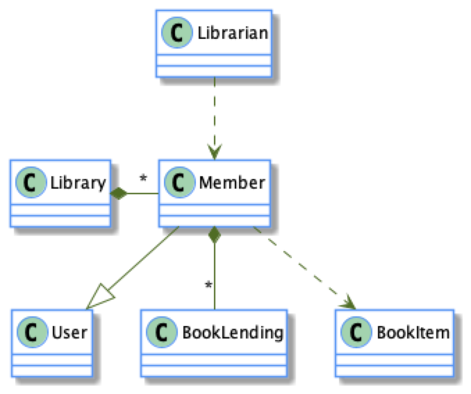
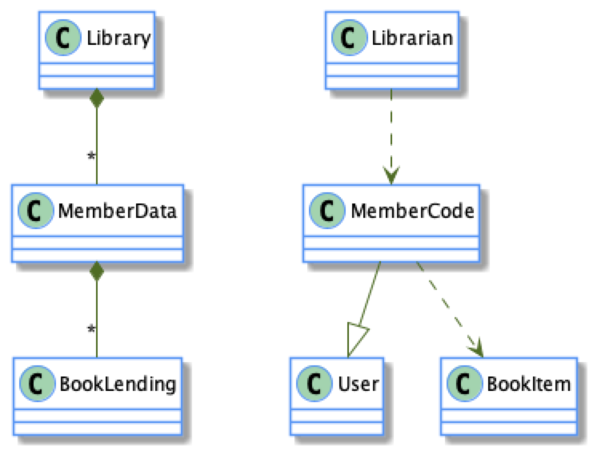
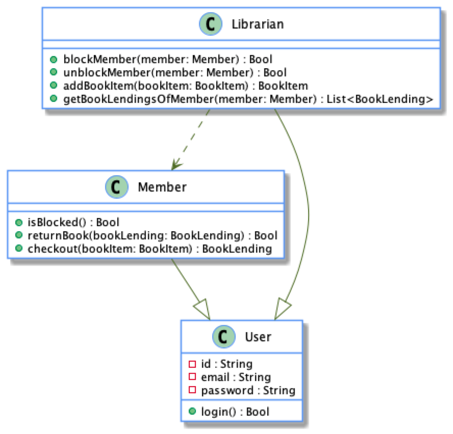
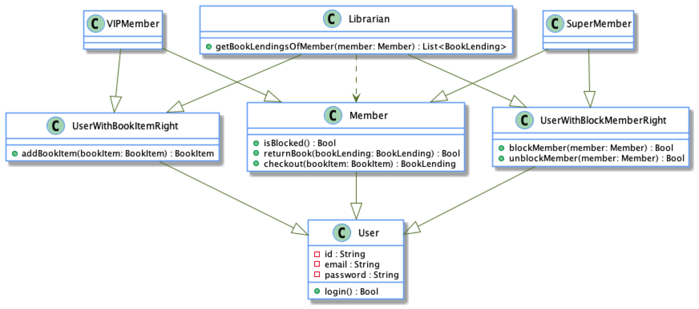

= OOP is more complex

== Object Class diagrams
As objects couple data + code you have model the relationships the same way. UML Class diagrams I much more complicated.

Which has 5 relations

Now if we decouple the code + data we get

* A MemberCode entity with 3 relations
* A MemberData entity with 2 relations

Making the system simpler and easy to understand as each class diagram can be understood separately

== Class hierarchies
Class hierarchies are bad at being extensible and handling change.

For example, we have this setup and think we know all the design upfront.

Then things change, and we have to add `VIP` members who can add books to the library but not block/unblock members like a `Librarian`.

image::resources/librarian2.png[VIP user]

We need to move the `addBookItem` implementation from `Librarian` into a new class `UserWithBookItemRight` so that both the `Librarian` and new `VIP` member can both inherit the implementation.

Then things change again. We need to add a `Super` user, who can block/unblock users. Again we need to move the implementation from `Librarian` into a new class `UserWithBlockMemeberRight` and update its inheritance.

