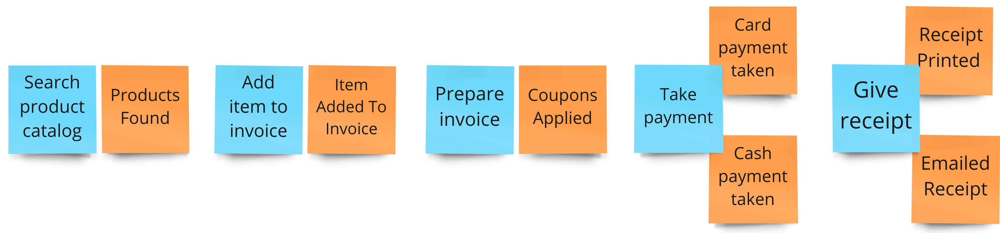
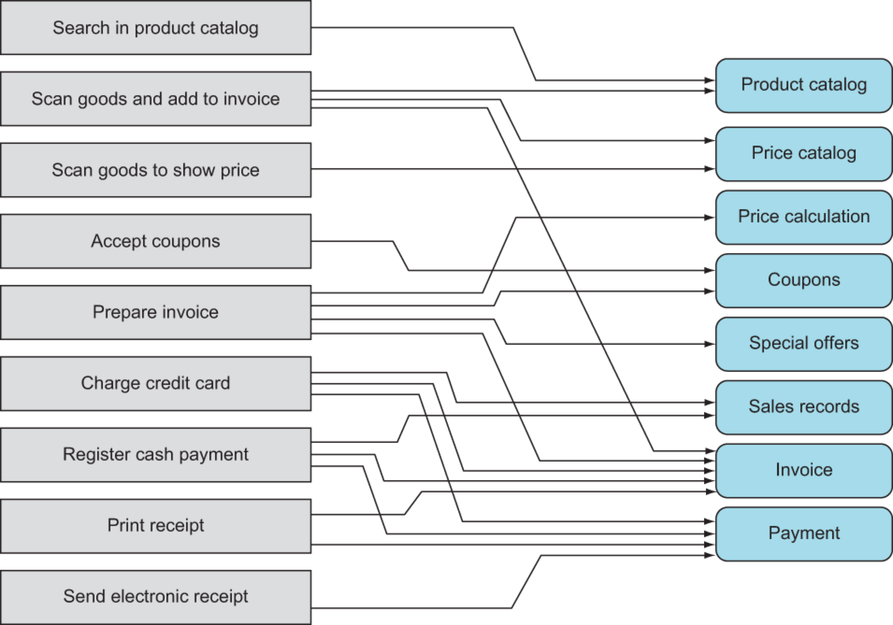

= Identifying and scoping microservices

== Why scoping is important
* Too big = Longer deployment for new features and bug fixes
* Too smaller = Tighter coupling between services
* Wrong coupling between services = Increases complexity

== Types of scoping

=== Business capabilities (Direct)
Capabilities that contributes towards business goals

* Examples
* (Shopping Cart) Allows users to purchase items
* (Notification) Send purchase notification to users

=== Supporting Technical capability (Indirect)
Capabilities that indirectly help towards business capabilities

* Examples
** (Anti corruption layer)
** A Notification service which then forwards the message to an (Email, SMS, Push notification) services

[NOTE]
====
Microservice qualities

* **Single responsibility principle (One capability)**
* **Individually deployable**
* **Small (Can be quickly rewritten and maintained by a small team)**
* Owns its own data store

Three of the main qualities all rely on getting the scope right
====

== How to scope

* Learn domain by talking to Domain experts and users
* Usually bounded contexts should match departments/sub departments

* Tools
** Event storming
** Listing capabilities to microservices

== Glossary

Bounded context::
Language is consistent across a process.

Asking different departments "How are the numbers looking?"

* Finance - "Profits are X, Revenue is Y"
* Warehouse - "We have moved X pallets, Y pallets have come in today"

Same question but interpreted differently depending on the context in which it was used.

Business capability::
What the business does

Domain experts::
People who know how the business works and it's processes

Anti Corruption Layer (ACL)::
Translator to avoid external design from impacting our design.
* Avoid having external protocols entering your system.
** Benefits
*** Translator - 3rd party system uses SOAP, but we use HATOES for internal communication. By adding an ACL that
translates from SOAP to HATOES our microservices can communicate to the 3rd party system through the ACL so that our
microservices don't have to know about SOAP
** Mapper - Rename/Reshape the data that comes from the external system to a more standardised format
